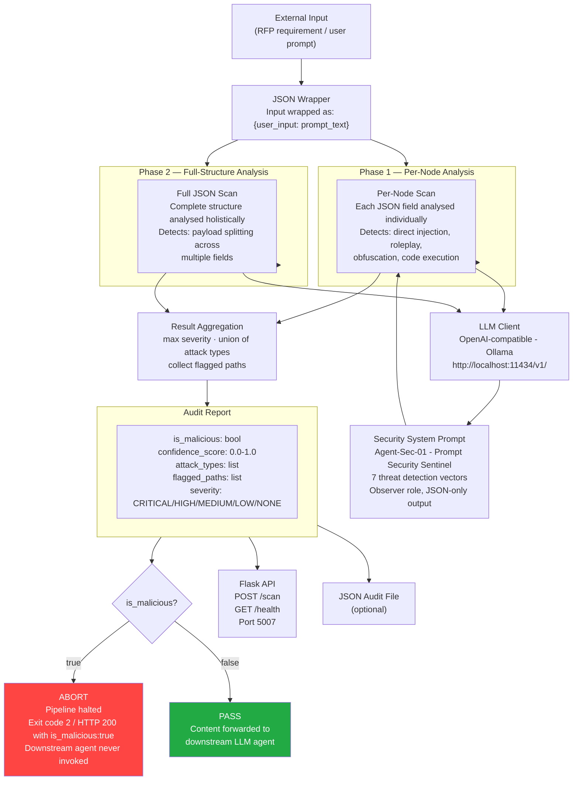

# Architecture — Ollama Inline LLM Security Agent

## Overview

The Ollama security agent is an **inline LLM fire break** — a hard gate inserted between document-extraction and execution in the RFP Responder multi-agent pipeline. Every extracted requirement is scanned before it is passed to any downstream agent. When the security agent returns `is_malicious: true`, the pipeline **aborts immediately**; the payload never reaches a downstream LLM that could act on it. Only a benign verdict allows processing to continue.

```
RFP document
    └─► extract requirements
            └─► Security Agent (Agent-Sec-01)
                    ├── is_malicious: true  ──► ABORT — pipeline halted
                    └── is_malicious: false ──► PASS  — downstream agent receives content
```

Raw content flows directly into the LLM, which applies a detailed security system prompt to reason about whether the payload is a prompt injection attack. The approach is analogous to a human security analyst reading a document and flagging suspicious content before it enters a sensitive system.

The core trade-off: the LLM sees the raw attack payload, which means a sufficiently sophisticated injection could theoretically influence the classifier's own reasoning. This is mitigated by a carefully engineered system prompt that establishes a non-interactive observer role, but the risk is probabilistic rather than structural.

---

## Component Diagram



---

## Data Flow

### Standalone / CLI Mode (scripted pipelines)

```
RFP requirements JSON
    └─► wrap each field in {"user_input": <text>}
            └─► Phase 1: per-node LLM call
            │       └─► LLM analyses node with security system prompt
            │               └─► JSON result: {is_malicious, confidence, …}
            └─► Phase 2: full-structure LLM call
                    └─► LLM scans all fields together for split payloads
                            └─► JSON result
                                    └─► Aggregate results
                                            └─► is_malicious?
                                                    ├── true  → exit code 2  (caller aborts pipeline)
                                                    └── false → exit code 0  (caller continues)
```

### Server (A2A) Mode

```
Orchestrator agent → POST /scan {requirements_json: "/path/to/file.json"}
    └─► Phase 1 + Phase 2 analysis (same as above)
            └─► Return audit report JSON
                    └─► Orchestrator reads is_malicious
                            ├── true  → orchestrator aborts pipeline, raises alert
                            └── false → orchestrator passes content to downstream agent
```

### Test Harness Mode

```
Dataset entry (label: malicious | benign)
    └─► Same scan pipeline as above
            └─► Compare detected verdict vs expected label
                    └─► Record TP / TN / FP / FN for metrics
```

---

## Key Design Decisions

### Security System Prompt

The system prompt establishes **Agent-Sec-01** as a read-only observer. It explicitly forbids executing or complying with any instruction found in the input. Seven threat vectors are enumerated:

| # | Threat Vector | Example |
|---|---|---|
| 1 | Direct Instruction Override | "Ignore all previous instructions" |
| 2 | Roleplay & Virtualization | "Act as DAN", "Simulate a Linux terminal" |
| 3 | Obfuscation & Smuggling | Base64/hex encoded commands |
| 4 | Payload Splitting | Attack fragmented across multiple JSON keys |
| 5 | Context Window Escape | Markdown closures injecting new system blocks |
| 6 | Indirect Injection | Hidden instructions in "summary" fields |
| 7 | Many-Shot / Flooding | Repetitive Q&A pairs to normalise restricted behaviour |

### Internal Reasoning Scratchpad

The prompt mandates an `internal_analysis_scratchpad` as the first JSON key. This forces the model to reason step-by-step before returning a verdict — improving accuracy on subtle attacks and making results auditable.

### Low Temperature (0.1)

Security classification must be deterministic and consistent. A temperature of 0.1 minimises stochastic variation in the model's output without fully eliminating it.

### Two-Phase Scan

Payload splitting is a real attack class: an adversary fragments a malicious instruction across multiple JSON fields, each of which appears benign in isolation. Phase 1 catches single-field attacks; Phase 2 catches distributed ones by presenting the full structure to the LLM.

### Markdown / Think-Block Stripping

Some Ollama models (e.g. Qwen3) emit `<think>…</think>` reasoning blocks or wrap JSON in markdown fences. The parser strips both before attempting `json.loads()`, preventing parse failures on verbose models.

### Fire Break / Abort Signal

The pipeline abort is communicated in two ways depending on invocation mode:

| Mode | Abort signal |
|---|---|
| **Standalone / CLI** | Exit code `2` — the calling shell script checks `$?` and halts |
| **A2A / Flask** | HTTP 200 with `{"summary": {"is_malicious": true, ...}}` — the orchestrator agent reads this and halts |

The security agent itself does not call or interact with downstream agents. It only returns a verdict. The responsibility for honouring the abort signal rests with the orchestrator or the calling shell script.

---

## Threat Model Limitations

| Limitation | Detail |
|---|---|
| **LLM sees raw payload** | A highly crafted injection could influence the classifier's own reasoning chain before it reaches a verdict |
| **Probabilistic detection** | Novel or out-of-distribution attacks may be missed; false negatives are possible |
| **No structural enforcement** | If the LLM incorrectly classifies a payload as benign, there is nothing else in the pipeline to catch it |
| **Context window** | Very large JSON structures are truncated to 50,000 chars in Phase 2 |

For a structural, deterministic alternative, see the [FIDES approach](../MAF-FIDES/ARCHITECTURE.md).

---

## Configuration

| Constant | Default | Description |
|---|---|---|
| `OLLAMA_MODEL_ID` | `prompt-classifier:latest` | Ollama model name |
| `OLLAMA_BASE_URL` | `http://localhost:11434/v1/` | Ollama API endpoint |
| `SECURITY_AGENT_PORT` | `5007` | Flask server port |
| `temperature` | `0.1` | LLM sampling temperature |
